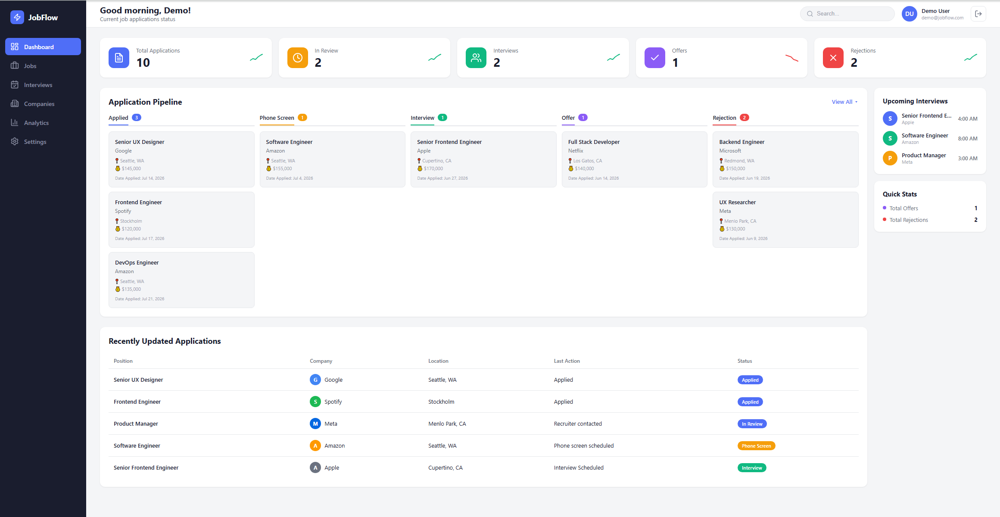
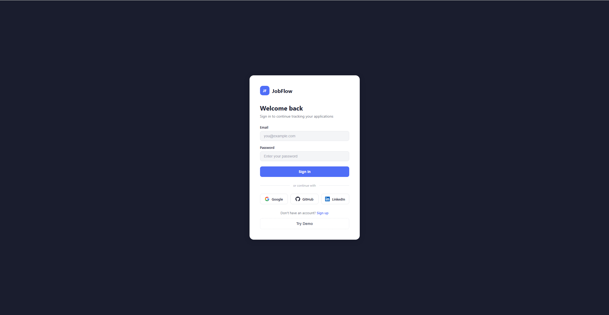
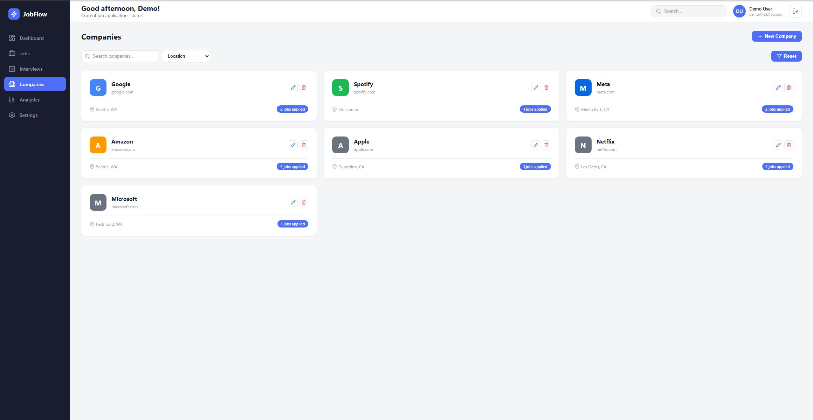
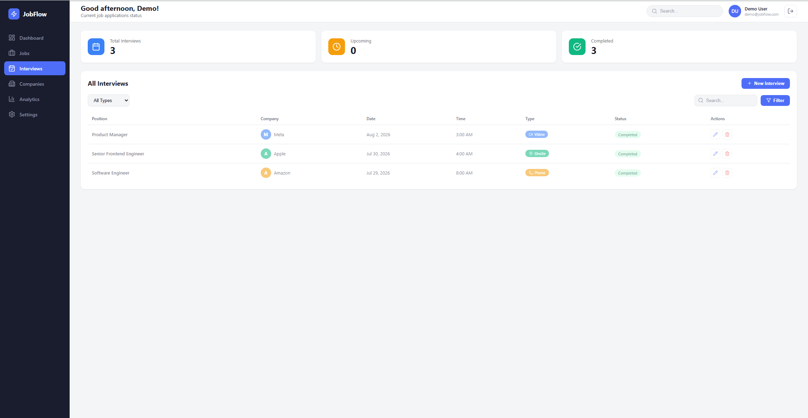
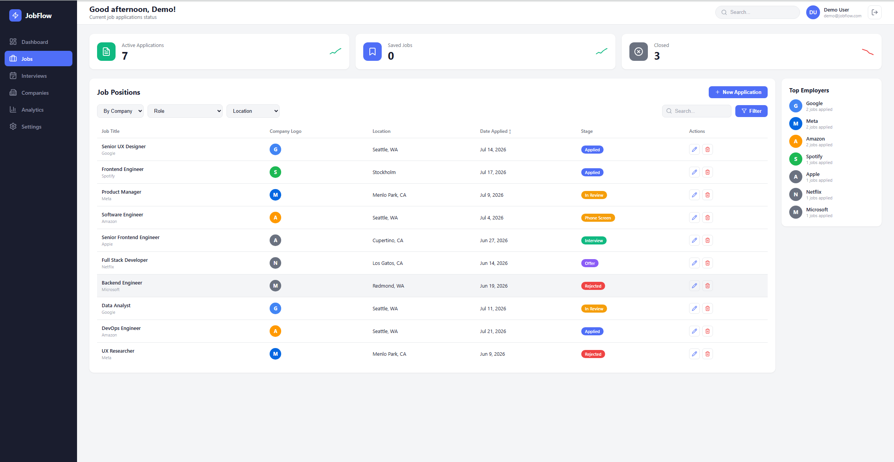
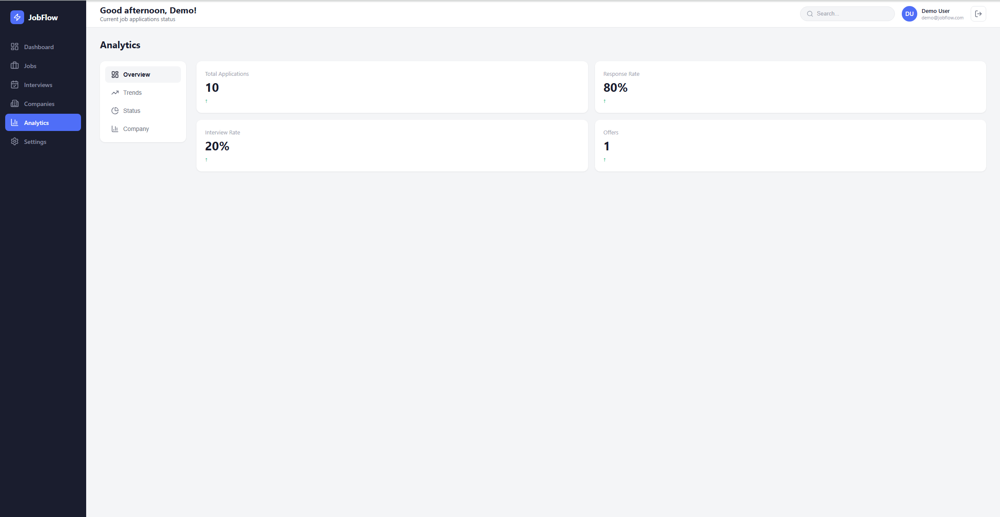
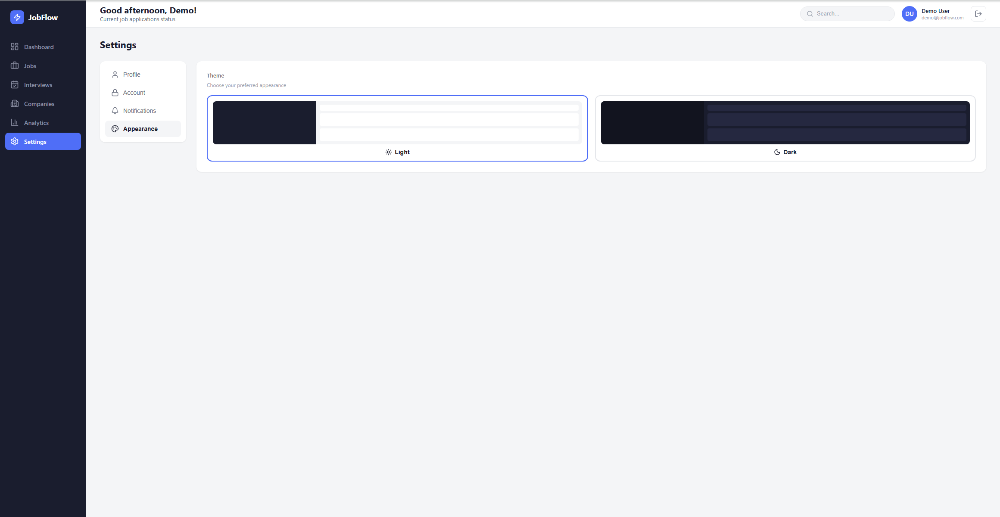

# JobFlow


A full-stack job application tracker with JWT + OAuth2 authentication, Kanban pipeline, interview management, and analytics dashboard.

## Screenshots



<table>
  <tr>
    <td><strong>Login</strong><br></td>
    <td><strong>Jobs</strong><br></td>
  </tr>
  <tr>
    <td><strong>Interviews</strong><br></td>
    <td><strong>Companies</strong><br></td>
  </tr>
  <tr>
    <td><strong>Analytics</strong><br></td>
    <td><strong>Settings</strong><br></td>
  </tr>
</table>

## Tech Stack

| Frontend | Backend | Database |
|----------|---------|----------|
| React 19, TypeScript, Vite | Java 21, Spring Boot 3, Spring Security | MySQL 8 (prod), H2 (test) |
| Axios, Recharts, React Router | JWT (HS256), Google/GitHub OAuth2 | Hibernate, Spring Data JPA |
| Vitest, React Testing Library | JUnit 5, MockMvc, Mockito | |

## Features

- **Auth** — Register/login with JWT, Google & GitHub OAuth2, demo mode
- **Dashboard** — Stat cards, Kanban pipeline, recent applications, upcoming interviews
- **Jobs** — Searchable application table with status tracking and top employers
- **Interviews** — Schedule and manage interviews linked to applications
- **Companies** — Company directory with search and per-company application count
- **Analytics** — Application trends, status distribution, per-company breakdown
- **Settings** — Profile, password management, theme switcher (dark/light)

## Getting Started

### Prerequisites

- Node.js 20+ / Java 21+ / MySQL 8+

### Setup

```bash
# 1. Clone
git clone https://github.com/jianweicheng0822/JobFlow.git
cd JobFlow/Jobtracker

# 2. Database
mysql -u root -p -e "CREATE DATABASE jobflow;"

# 3. Backend (starts on :8080)
cd job-flow-backend
./mvnw spring-boot:run

# 4. Frontend (starts on :5173)
cd ../job-flow-frontend
npm install && npm run dev
```

Update `job-flow-backend/src/main/resources/application.yml` if your MySQL credentials differ.

OAuth is optional — set `GOOGLE_CLIENT_ID`, `GOOGLE_CLIENT_SECRET`, `GITHUB_CLIENT_ID`, `GITHUB_CLIENT_SECRET` as env vars to enable. The app works without them.

> **Demo Mode:** Click "Try Demo" on the login page to explore with mock data, no backend needed.

## API Endpoints

All endpoints except `/api/auth/**` require `Authorization: Bearer <token>`.

| Resource | Endpoints |
|----------|-----------|
| **Auth** | `POST /register`, `POST /login`, `GET /me`, `PUT /profile`, `PUT /password` |
| **Applications** | `GET /`, `GET /{id}`, `POST /`, `PUT /{id}`, `PATCH /{id}/status`, `DELETE /{id}`, `GET /stats`, `GET /recent`, `GET /activity` |
| **Interviews** | `GET /`, `GET /{id}`, `GET /upcoming`, `POST /`, `PUT /{id}`, `DELETE /{id}` |
| **Companies** | `GET /`, `GET /{id}`, `POST /`, `PUT /{id}`, `DELETE /{id}` |

Base paths: `/api/auth`, `/api/applications`, `/api/interviews`, `/api/companies`

## Testing

**62 tests** — backend integration + unit tests, frontend component + API tests.

```bash
# Backend
cd job-flow-backend && ./mvnw test

# Frontend
cd job-flow-frontend && npx vitest run
```
